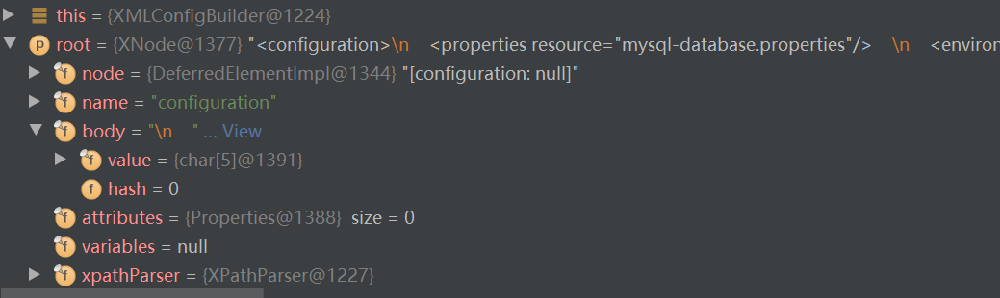

### mybatis学习(一)-源码篇

```
    //获取SqlSessionFactory
    private static SqlSessionFactory getSqlSessionFactory() {
         SqlSessionFactory sqlSessionFactory = null;
         String resource = "mybatis-configuration.xml";  //mybatis的配置文件
         try {
             InputStream inputStream;
             sqlSessionFactory = new SqlSessionFactoryBuilder().build(Resources.getResourceAsStream(resource));
         } catch (IOException e) {
             e.printStackTrace();
         }
         return sqlSessionFactory;
    }

    //1.初步搭建的demo
    public static void testFindUserList() {
        SqlSession sqlSession = getSqlSessionFactory().openSession();
        UserDao userDao = sqlSession.getMapper(UserDao.class);
        List<User> userList = userDao.findAllUserList();
        log.info("userList >>>>> {}", userList);
        sqlSession.close();
    }
```

上面这段代码是个简单的demo,第一个方法是获取sqlSessionFactory, 第二个方法是使用openSession()开启一个会话,
获取一个SqlSession，然后获取到Mapper接口的代理对象,做了一个查询所有用户的操作。

接下来我们就看看SqlSessionFactoryBuilder里面的东西, SqlSessionFactoryBuilder里面的方法都是用于获取
SqlSessionFactory对象的,可以看到build里面的具体实现，看来我们想知道他的配置文件是怎么解析的，我们就知道看
哪里了，哈哈哈，继续，
```
public SqlSessionFactory build(Reader reader);
public SqlSessionFactory build(Reader reader, String environment, Properties properties);
//很明显在我们的DEMO这个里面调用的就是这个方法, 往下看，下面就是我们这个方法的具体实现
public SqlSessionFactory build(InputStream inputStream);
public SqlSessionFactory build(InputStream inputStream, String environment, Properties properties); 
```
因此很自然看到了XMLConfigBuilder,这个里面做了些啥，new了一个XPathParser的解析类，他将一个类的部分属性赋了一些值,之后
调用了createDocument()方法，给我的感觉就像是new了一个java自带的解析xml解析器,然后调用方法parse()去解析了。并且返回了
一个document对象，赋值给成员变量，现在看起来，似乎好像只是拿到了解析器一样，然后调用XMLConfigBuilder的构造方法进行赋值
给对应的成员变量，值得注意的的是super(new Configuration()),在这个里面，进行了一些别名的注册。至此，换句话说，到这一步也
就相当于算是拿到了我们的XMLConfigBuilder的一个实例，里面含有解析器，注册的别名信息，以及经过解析的Document对象信息等等。
是不是很气，到现在还没看到解析...莫急，在后面在....
继续看...接下来一句 return build(parser.parse()); parse()方法进去你就能看到parseConfiguration
(parser.evalNode("/configuration"));这一句是不是很熟悉，这不是我们配置文件里面的configuration节点么，这个body里面不就是
我们的配置信息么。

ok,nice,继续看parseConfiguration方法
```
    //装载各个节点的信息
    private void parseConfiguration(XNode root) {
        try {
          //issue #117 read properties first
          propertiesElement(root.evalNode("properties"));
          Properties settings = settingsAsProperties(root.evalNode("settings"));
          loadCustomVfs(settings);
          loadCustomLogImpl(settings);
          typeAliasesElement(root.evalNode("typeAliases"));
          pluginElement(root.evalNode("plugins"));
          objectFactoryElement(root.evalNode("objectFactory"));
          objectWrapperFactoryElement(root.evalNode("objectWrapperFactory"));
          reflectorFactoryElement(root.evalNode("reflectorFactory"));
          settingsElement(settings);
          // read it after objectFactory and objectWrapperFactory issue #631
          environmentsElement(root.evalNode("environments"));
          databaseIdProviderElement(root.evalNode("databaseIdProvider"));
          typeHandlerElement(root.evalNode("typeHandlers"));
          mapperElement(root.evalNode("mappers"));
        } catch (Exception e) {
          throw new BuilderException("Error parsing SQL Mapper Configuration. Cause: " + e, e);
        }
    }
```

这里需要注意一个方法的调用 **mapperElement(root.evalNode("mappers"));**
这个不用说了吧，想来应该是我们配置文件里面的mapper文件配置信息，这个我们后面再说。

现在回过头来看SqlSessionFactoryBuilder是不是就很清晰的知道SqlSessionFactory怎么来的了。
```
    public SqlSessionFactory build(Configuration config) {
        return new DefaultSqlSessionFactory(config);
    }
```


